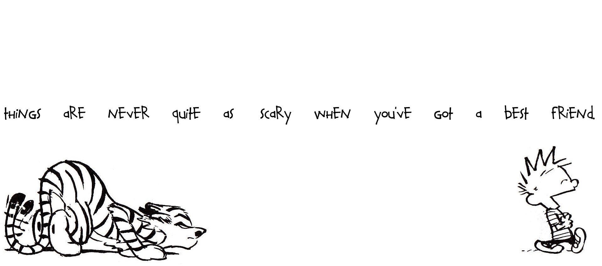

# Calvin and Hobbes quotes
[](https://travis-ci.org/Siilwyn/calvin-and-hobbes-quotes)

The quote list is just a [JSON file](src/quotes.json) and can be used wherever.  
*I tried picking quotes that are not too lengthy and that don't need context.*



All rights reserved to Bill Watterson for both the image above and all these brilliant quotes.

## Install
```
$ npm install --save calvin-and-hobbes-quotes
```

## Usage
```js
const calvinAndHobbesQuotes = require('calvin-and-hobbes-quotes');

console.log(`“${calvinAndHobbesQuotes.random()}”`);
// returns “Life is full of surprises, but never when you need one.”
```

## API

### .all
Type: `array`

List all quotes.

### .random()
Type: `function`

Random quote.

## CLI
```
$ npm install --global calvin-and-hobbes-quotes
```

```
$ calvin-and-hobbes-quotes --help

Usage:
  $ calvin-and-hobbes-quotes

Commands:
  Options:
    -h, --help      Print usage
    -a, --all       Print all Calvin and Hobbes quotes

Examples:
  $ calvin-and-hobbes-quotes                      # prints a random quote
  $ calvin-and-hobbes-quotes -a                   # lists all quotes
```

## Contributing
See a quote that is not in the comics or has an error? Please create an issue or open a pull request.  
Want to add a quote? Make sure the quote is present in the original comics and use proper [quotation characters](http://smartquotesforsmartpeople.com/).

___

*Inspired by reading Calvin and Hobbes and bumping into [cat-names](https://github.com/sindresorhus/cat-names) and [random-tree-names](https://github.com/pguth/random-tree-names/).*
